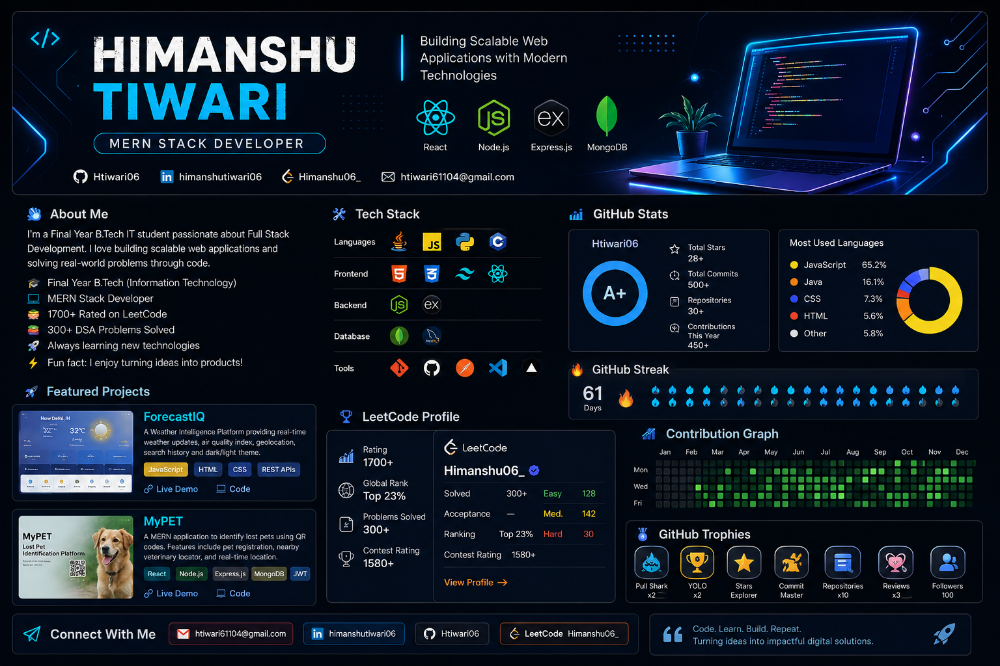

# Hi 👋, I'm Himanshu Tiwari

  

  

  
  
  
  

---

# 💫 About Me

- 🎓 Final Year B.Tech (Information Technology) Student
- 💻 Passionate Software Developer
- 🌐 MERN Stack Developer
- ☕ Java for Data Structures & Algorithms
- 🏆 1700+ Rated on LeetCode
- 📚 Solved 300+ DSA Problems
- 🌱 Currently learning Backend Architecture, System Design & Cloud
- 🎯 Looking for Software Engineering Opportunities

---

# 🛠 Tech Stack

### Languages

### Frontend

### Backend

### Database

### Tools

---

# 🚀 Featured Projects

## 🌦 ForecastIQ

A modern weather intelligence platform providing:

- Real-time Weather Forecast
- Air Quality Index
- Browser Geolocation
- Search History
- Glassmorphism UI
- Dark / Light Theme

**Tech Stack:** JavaScript • HTML • CSS • REST APIs

**GitHub:**  
https://github.com/Htiwari06/ForeCastIQ

**Live Demo:**  
https://superb-sopapillas-980c9e.netlify.app/

---

## 🐶 MyPET

A MERN-based pet identification platform featuring:

- JWT Authentication
- QR Code Generation
- Pet Registration
- Nearby Veterinary Finder
- Interactive Maps
- Secure MongoDB Backend

**Tech Stack:** React • Node.js • Express.js • MongoDB • JWT • Leaflet

**GitHub:**  
https://github.com/Htiwari06/My-Pet

**Live Demo:**  
https://mypetfrontend1.vercel.app/

---

# 📊 GitHub Stats

  
  

---

# 🔥 GitHub Streak

  

---

# 💻 LeetCode

  

---

# 🎯 2026 Goals

- ✅ Solve 500+ DSA Problems
- 🚀 Master System Design
- 🌐 Contribute to Open Source
- 💼 Build Production Ready Projects
- 🎯 Secure a Software Engineer Role

---

# 📫 Connect With Me

- 📧 **Email:** htiwari61104@gmail.com
- 💼 **LinkedIn:** https://www.linkedin.com/in/himanshutiwari06/
- 💻 **GitHub:** https://github.com/Htiwari06
- 🧩 **LeetCode:** https://leetcode.com/u/Himanshu06_/

---

⭐ Thanks for visiting my profile!

  

